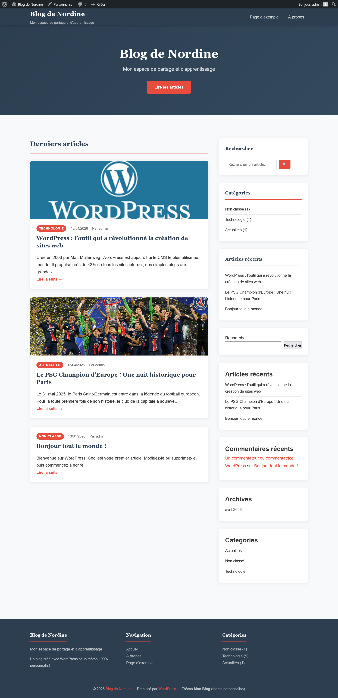
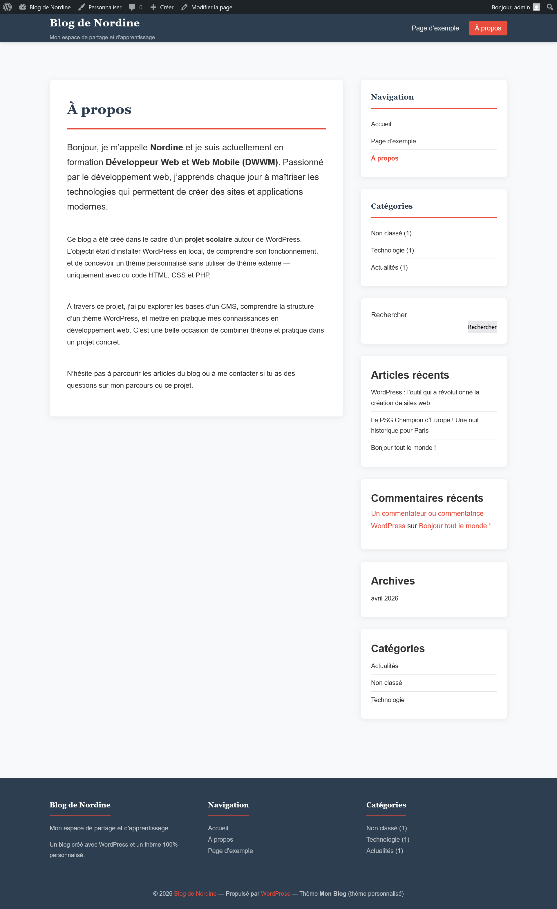
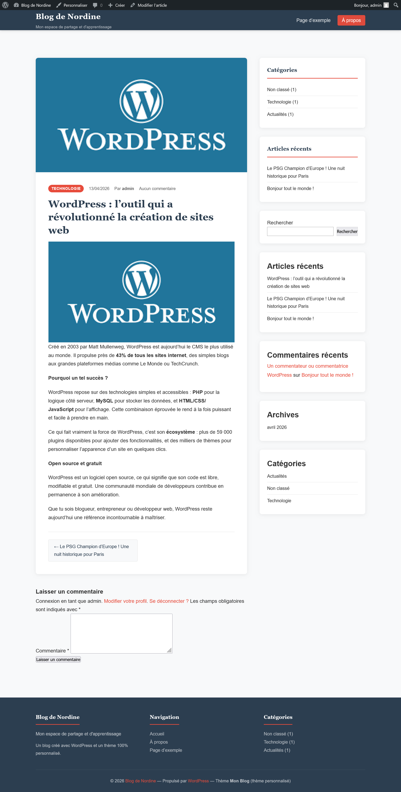
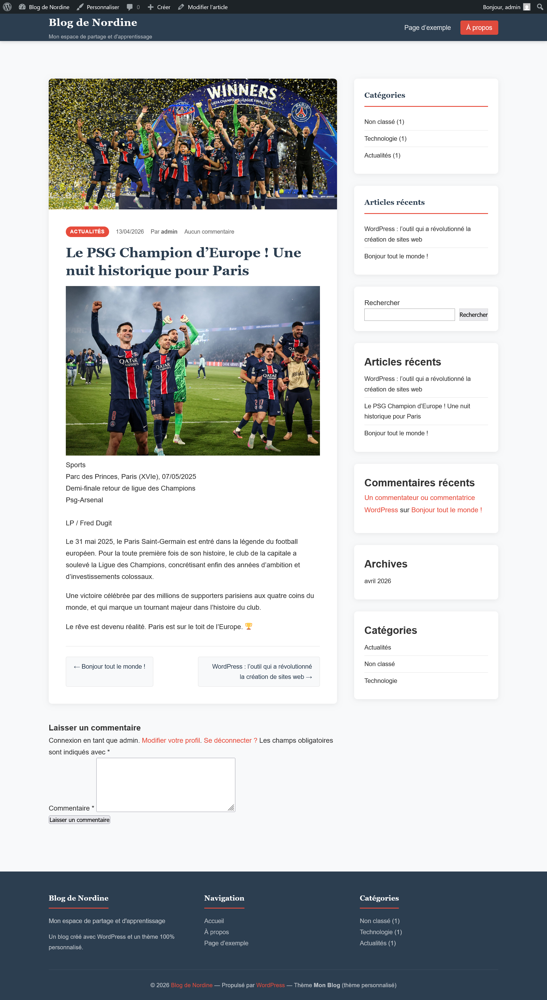

# Blog de Nordine — Projet WordPress DWWM

Projet scolaire réalisé dans le cadre de la formation **Développeur Web et Web Mobile (DWWM)**.

## Objectif

Installer WordPress en local, comprendre le fonctionnement d'un CMS, et créer un thème personnalisé **sans thème externe** — uniquement avec du code PHP, HTML et CSS.

---

## Aperçu du site

### Page d'accueil


### Page À propos


### Article — Technologie


### Article — Actualités


---

## Technologies utilisées

| Technologie | Rôle |
|---|---|
| **WordPress** | CMS (système de gestion de contenu) |
| **PHP** | Logique serveur, templates du thème |
| **MySQL** | Base de données (articles, pages, utilisateurs) |
| **HTML5** | Structure des pages |
| **CSS3** | Design et mise en page (thème personnalisé) |
| **JavaScript** | Navigation responsive mobile |
| **Laragon** | Serveur local (Apache + PHP + MySQL) |

---

## Structure du thème personnalisé

```
mon-blog/
├── style.css         → Design complet du blog + en-tête du thème
├── functions.php     → Configuration (menus, widgets, images)
├── index.php         → Page d'accueil / liste des articles
├── single.php        → Affichage d'un article complet
├── page.php          → Pages statiques (À propos...)
├── header.php        → En-tête + navigation
├── footer.php        → Pied de page
├── search.php        → Résultats de recherche
├── searchform.php    → Formulaire de recherche
├── 404.php           → Page erreur introuvable
└── js/
    └── navigation.js → Menu hamburger responsive
```

---

## Fonctionnalités du blog

- Thème 100% personnalisé (aucun thème externe)
- Page d'accueil avec bannière hero et liste des articles
- Page **À propos**
- Articles organisés par **catégories** (Technologie, Actualités, Tutoriels)
- **Barre latérale** avec catégories et articles récents
- **Navigation** précédent / suivant entre les articles
- Design **responsive** (mobile, tablette, desktop)
- Page **404** personnalisée
- **Recherche** intégrée

---

## Installation en local

### Prérequis
- [Laragon](https://laragon.org) (ou XAMPP / MAMP)
- [WordPress](https://wordpress.org/download)

### Étapes

1. Installer Laragon et le démarrer
2. Télécharger WordPress et le placer dans `C:\laragon\www\mon-blog\`
3. Créer une base de données `mon_blog_db` via phpMyAdmin
4. Configurer `wp-config.php` avec les identifiants de la base de données
5. Ouvrir `http://localhost/mon-blog` et suivre l'installation
6. Copier le dossier `mon-blog/` (thème) dans `wp-content/themes/`
7. Activer le thème dans **Apparence → Thèmes**

---

## Auteur

**Nordine** — Stagiaire en formation DWWM
Projet réalisé en avril 2026
